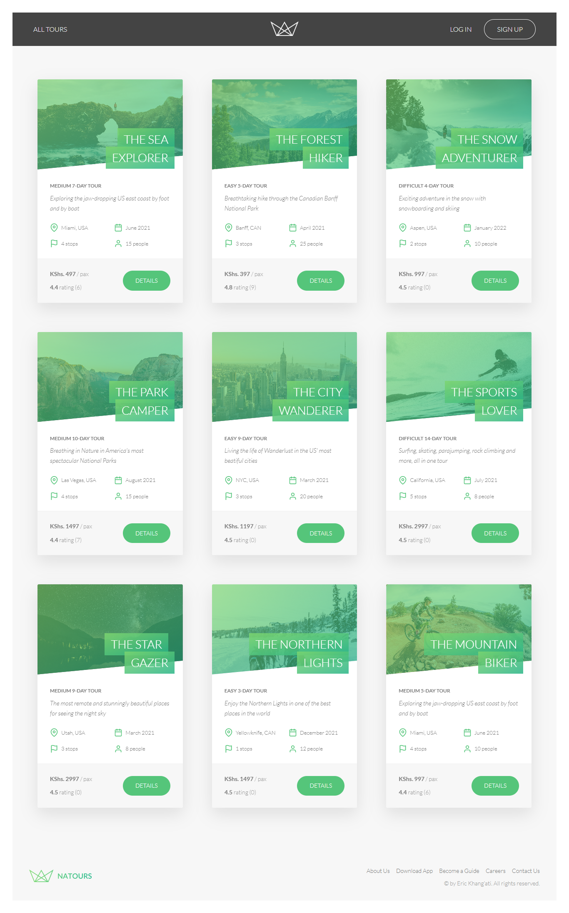

# Mapty Workout App

## Welcome! 👋

This is a simple tours booking app.

It has tour packages that are logged in different locations that a group people can subscribe to.

## How it works

On the home page, there are tour packages that will list on a directory of cards.

Click on any to view details of different packages and locations.

Then the user can sign up / login to make a booking.

The app will create a user account that will store their details and bookings.

Payments are made using Stripe Checkout.

## Technologies Used

1. NodeJs
2. Express
3. MongoDB
4. Mongoose
5. Stripe

## Live link to the Natours - Tours Booking App

[https://natours-eric.herokuapp.com/](https://natours-eric.herokuapp.com/ 'Natour App')
